# IS452 Installation Instructions

## What you'll be doing

You’ll be installing two things:

1.	Anaconda (for Python)
2.	PyCharm education edition (for working with Python)

Here is a screencast of me going through the installation process on a mac: https://mediaspace.illinois.edu/media/Python+installation+for+IS452/1_5zdddgk3

If you have already been using Python contact me before following these directions.  Continuing on may blow away your previous package links, etc. If you’ve not installed anything related to python on your computer you don’t need to worry.

Both of these items are mandatory! Even if you don’t see why we are installing Anaconda, you must still install it.

I do not formally require the use of these programs to write your code, because there’s no real way to check.  However, if you have strong opinions about which environment you’d like to use, I suspect that 452 isn’t an appropriate class for you.  That said, you may use a different environment if you find one that you like, but I cannot guarantee that I can help you with any issues you might run into.

## When you have problems

Check the Installation Problems discussion board for similar problems.  Post about your issue there and email me to let me know what problems you had.  Please be specific and provide screenshots.  I need to know what you did and what happened, with specific information, in order to help you.

## Install Anaconda

### Download

From here:  [https://www.anaconda.com/download/](https://www.anaconda.com/download/)

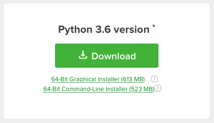

Download the Graphical Installer for Python 3.6 for your operating system.  The exact text on this screen may vary depending on your operating system, but you want the big green button for Python version 3.6. This is a pretty large download, so you’ll need to give it some time.  Installing all the normal options is just fine.

Anaconda will install Python and a lot of other background utilities that we’ll be using.  Anaconda isn’t an application that you’ll be opening and directly interacting with, but you will still be using what it installed.

* Mac users:  all the defaults should be fine, continue on to the testing.
* Windows users: you need to check the option to add Python to the path, seen in the screen shot below. Don't worry about the red warning text -- this checkbox is correct.

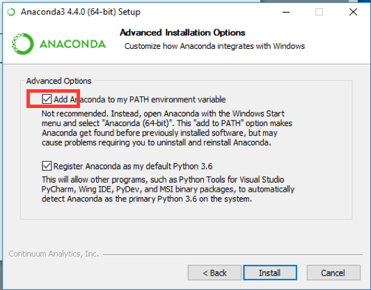

### Give it a test

After Anaconda has finished, restart your computer.  Now we’ll test that everything worked.  You’ll be using Anaconda (you will see it in Pycharm as, "CONDA") the entire class, but it’ll be somewhat invisible to you.

### Step 1: Open your command line

Windows users:  open up your Command Prompt application (in your system search bar, type in ‘cmd’ and an application will open up.  Youtube has videos explaining this more if you need it.

Mac users:  open your Terminal application. Either search via spotlight for ‘terminal’ or open it from Applications -> Utilities -> Terminal.  

### Step 2:  Attempt to launch Python

Mac/Windows: Within your command line application, type in ‘python’ (without quotes) and press return.  
Windows users:  you should *not* get an error that it doesn’t know what Python is.
Mac users:  it should state it is Python 3.6 and not Python 2.7.

You should see something like this if it worked.  Note that at the top it says “Python 3.6.1” and not “Python 2.7…”  Your installation may have a different third number, e.g. “Python 3.6.2” or something else, and that’s fine.  So long as it starts with 3.6 we’re good.

Just close and quit the program after this.  Everything has worked and you can move on to installing PyCharm Education edition.

Mac:
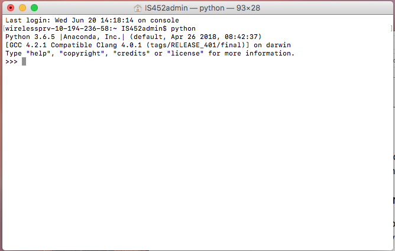

Windows:

## Install PyCharm Education edition

There are three editions of PyCharm.  I recommend starting with the education edition, and the directions here will follow that.  You may use the Community or Professional edition, if you like and these directions should be reasonably correct, but you’re responsible for anything that goes wrong.  You can always upgrade later.

### Step 1: Download and install

Available here:  https://www.jetbrains.com/pycharm-edu/download/

Download and install the appropriate version for your operating system.  Just use the newest version available, don’t worry about the numbers.

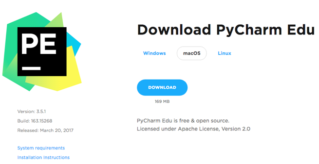

### Step 2:  Open it!

When you open it for the first time it’ll ask you what sort of project you want.  Select Create New Project. (ignore the version number here)

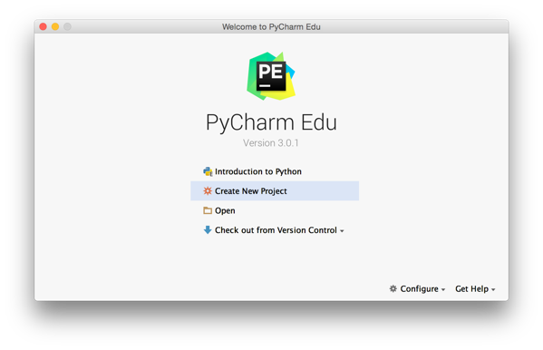

On the next screen you’ll want change a few things:

1.	Select the Location where you want your project folder to exist on your computer.  I suggest putting it in your Documents folder.
2.	Change Untitled to IS452.
	* You may also change where this folder is saved on your computer, just be sure that it is somewhere you can find so that you can upload files.
3.	For interpreter, this is where it gets weird.  Click the drop down:
	* Windows users, the drop down should show something like C:\Anaconda\python.exe.  Which you should select.  
	* Mac users, you might see several.  You want the one that has anaconda in the file path.  E.g. ~/anaconda/bin/python.  You may not see a number, but you want to choose the one that has Python 3.6.x (where x is whatever number you saw earlier during testing). Do not choose one that states Python 2.6 or 2.7.  you may need to click the … button and manually add where your ~/anaconda/bin/python exists. If you have a brand new installation, you likely have a 2.6, 2.7, and ~/anaconda/bin/python option.  Select the anaconda one.  If you select 2.6 or 2.7 you’ll have to go back and fix it, so this does matter.
4. You should have something that looks like the screenshot below, but yours will look different and that’s fine so long as the versions are correct which we will test in the next step.

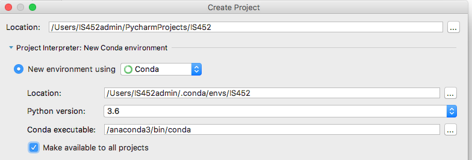

### Step 3:  Make a python file and try running it

Don’t worry, you don’t need to know python yet. We’re just testing to see if everything is working.

1. Right click on the name of your project on the left.  Select New -> Python file.
	* 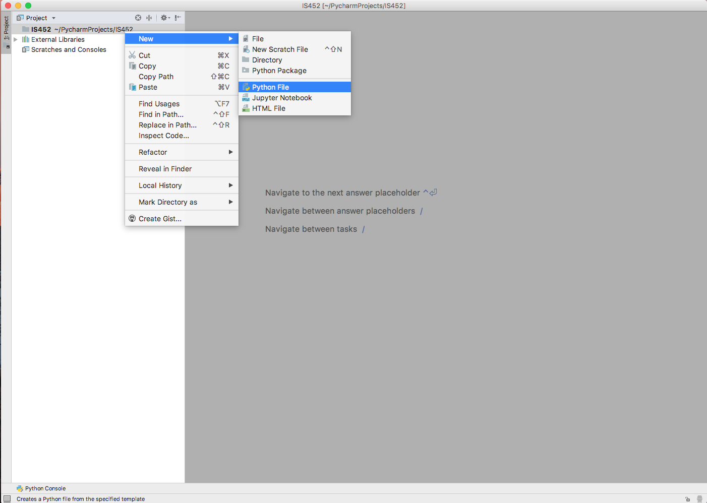
2. Name is something like ‘testing’.
	* 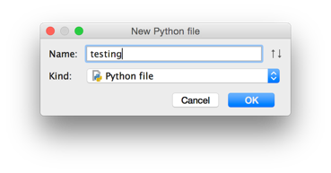
3. You’ll now see an empty file in the main part of the PyCharm window.
4. Type in the following into that screen:  `print(“Hello world”)`
	* 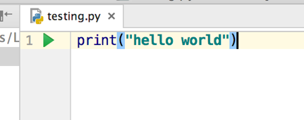
5. A green “play” arrow should appear next to line 1 next to that text.  It may take a minute or two for the green button to appear.  That is completely normal and just PyCharm connecting to your anaconda installation.
6. Click that green button!
7. A new panel at the bottom should appear, with text that starts with “Hello world”. “Process finished with exit code 0” means that everything worked and is not something to worry about.  Looks weird, though, I know.
	* 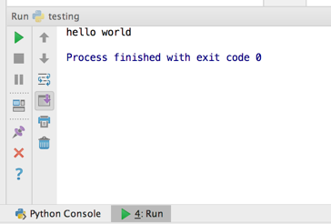
8. Now, let's test that you got Python 3 and not Python 2.
9. Change that code to `print "hello world"`.  PyCharm should now be putting some red on your screen to warn you that this is an error.
	* 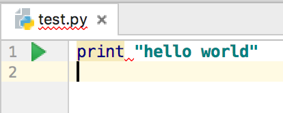
10.  Try to run the code.
11.  You should see an error!
	 * 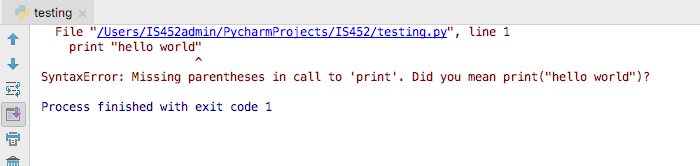
